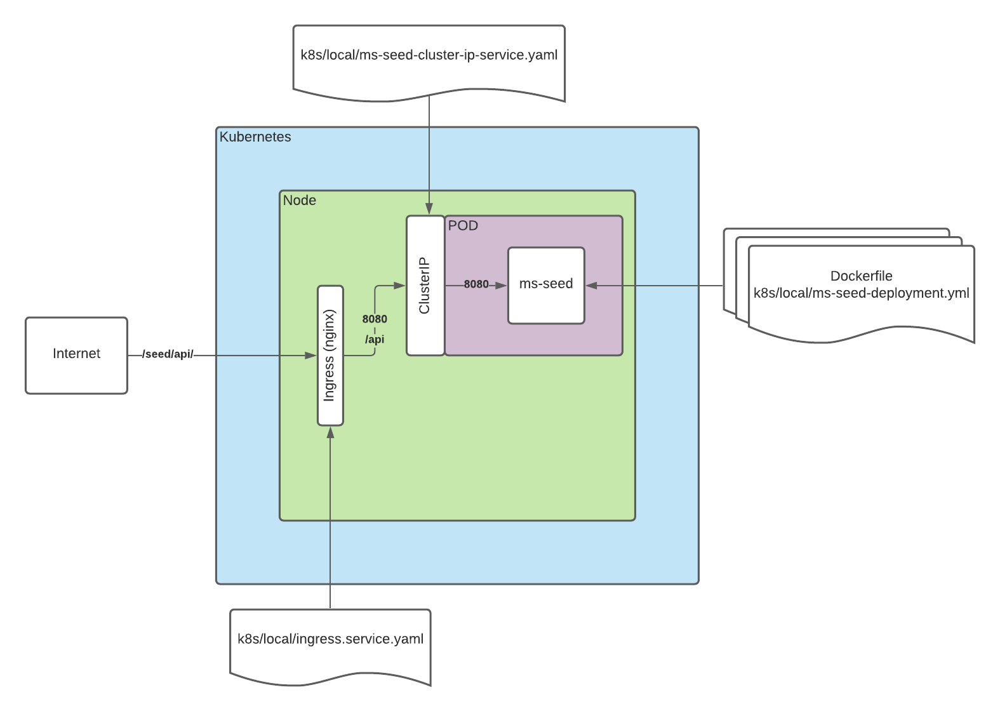

# spk-seed-evolution

Repositorio base, para ser usado a modo de semilla al construir microservicios, utilizando como lenguaje Kotlin, y Spring-Boot como framework.

## Arquitectura

Tomando en cuenta la complejidad y la incertidumbre en cuánto a las tecnologías y del negocio en si, vemos pertinente el uso de una arquitectura limpia, que nos abstraiga de dichas complejidades y a la vez nos brinde ese desacoplamiento entre las clases de negocio, con las propias de infraestructura. En este caso usaremos una interpretación de arquitectura hexagonal.


|   Arquitectura Limpia    | Arquitectura Hexagonal  |
|:------------------------:|:-----------------------:|
|  |  |

## Casos de uso

* Cada puerto de entrada o salida, deberá usar Either (Arrow) como wrapper de la respuesta, para manejar flujo principal y alterno
* Favorecer el uso de flujos reactivos, en este caso preferir siempre el Flow de kotlinx.coroutines, en vez de Flux/Mono de reactor.
* Flujo guiado por eventos
* Se usará gitflow como branching model
* Apuntar a un 75% de coverage en cada feature que se suba (si es más mejor).
* Continuará...


## Acuerdos para el desarrollo

[Introduzca acuerdos acá]

## Setting up local environment

- This setup scopes a full environment including a local kubernetes deployment in order to mirror the application
  deployment scenario as real as possible.
- It is also possible to run the application via terminal or using IDE's such as JetBrains Intellij IDEA or VSCode
- A Docker installation with the eventually necessary images such as redis should also be enough in order to develop
  locally

### Pre-requisites

- [SDKMAN! for Gradle, Java 11 and Kotlin installation](https://sdkman.io/)
- [Docker](https://docs.docker.com/get-docker)
- [A local installation for Kubernetes](https://kubernetes.io/docs/setup)

### Starting the app locally

- Run the following commands:

```
docker run -d -p 5500:5000 --name registry registry:2.7
```

### Run

- To run app with docker-compose (https://localhost/):

```
./assets/local/docker-compose/scripts/up.sh
```

- To run app with Kubernetes (https://kubernetes.docker.internal/):

The following command will install an nginx ingress controller into your kubernetes cluster
```
kubectl apply -f https://raw.githubusercontent.com/kubernetes/ingress-nginx/controller-v1.0.0/deploy/static/provider/cloud/deploy.yaml
```

The following command will install the microservice into your kubernetes cluster
```
./assets/local/k8s/scripts/install.sh
```

The component will be deployed with the following structure:


### Stop

- To stop app with docker-compose:

```
./assets/local/docker-compose/scripts/down.sh
```

- To remove app from k8s cluster:

```
./assets/local/k8s/scripts/uninstall.sh
```

### Running or debugging without Docker

If you prefer run app using some IDE like IntelliJ by configuring "Run configurations", please note the envvars you have
to define (values are examples):

- LOG_LEVEL: debug
- SPRING_PROFILES_ACTIVE: loc
- SPRING_DATASOURCE_URL: jdbc:postgresql://localhost:5432/postgres
- SPRING_DATASOURCE_USERNAME: postgres
- SPRING_DATASOURCE_PASSWORD: postgres
- SPRING_DATA_MONGODB_HOST: localhost
- SPRING_DATA_MONGODB_PORT: 27017
- SPRING_REDIS_HOST: localhost
- SPRING_REDIS_PORT: 6379
- SPRING_KAFKA_BOOTSTRAP_SERVERS: localhost:9092

### Health check endpoints

- [GET] /domain/health
- [GET] /domain/health/readiness
- [GET] /domain/health/liveness

### Api docs endpoint

- [GET] /domain/swagger-ui.html

### Example endpoints

- [GET] /domain/samples
- [GET] /domain/samples/1

NOTE: Api is fully documented in the Api docs endpoint.

## Gitlab configuration

- In order for the CICD pipeline to work, set the following variables in Settings -> CICD -> Variables:
    - `AWS_REGION`: Generally us-east-1
    - `AWS_AK`: Access Key for the IAM User associated with this pipeline
    - `AWS_SK`: Secret Key for the IAM User associated with this pipeline
    - `AWS_ECR_URL`: AWS Elastic Container Registry URL in order to push docker images
    - `DOCKER_IMAGE_NAME`: Resulting docker image name for the built project
    - `TESTCONTAINERS_HUB_IMAGE_NAME_PREFIX`: If your TestContainers configuration needs to point to an ECR instance accessible from the pipeline

## Running Tests

### Test containers - image resolution

#### Usage with DockerHub

In order to download your containers for integration test from DockerHub, please do not modify the `testcontainers.properties` file in `src/test/resources` folder. With this configuration, it will point to DockerHub. You also need to perform a previous login to DockerHub.

```
gradle test
```

#### Usage with ECR
In order to use ECR, the following is required:
- AWS Azure Login in order to configure aws credentials to connect to ECR
- AWS CLI in order to perform a login to ECR to download docker images
- Keep in mind that GitLab pipelines will use ECR repositories to avoid DockerHub rate limit. If a new docker image is needed and it doesn't exist in AWS ECR, please contact your DevOps team in order to add the image to ECR

For example, for a profile that matches an aws account and a ECR Repository URL:

```
aws-azure-login --profile prisma-arch-sandbox
aws ecr get-login-password --region us-east-1 --profile prisma-arch-sandbox | docker login --username AWS --password-stdin 682320626241.dkr.ecr.us-east-1.amazonaws.com
gradle test
```


## Links útiles

* https://trunkbaseddevelopment.com/
* http://blog.cleancoder.com/uncle-bob/2011/09/30/Screaming-Architecture.html
* https://jesusledesma.medium.com/migrando-a-clean-architecture-webflux-con-corrutinas-en-kotlin-parte-1-ec382b933438
